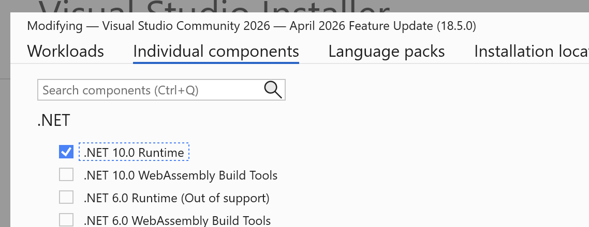

# Day 1

## Goals by end of morning day 1

1. .NET and Visual Studio Community editions installed
2. Read through the basics C# guides on Microsoft's documentation site
3. Forked the practice repository and submitted the exercise solutions

## 1. Install Visual Studio & ASP.NET (~1hr)

1. Download and install [Visual Studio Community Edition](https://visualstudio.microsoft.com/vs/community/)
2. You can follow the [official installation guide](https://learn.microsoft.com/en-us/visualstudio/install/install-visual-studio?view=visualstudio#step-4---choose-workloads) making sure to select "ASP.NET and web development" and the `.NET desktop development` workloads. Make sure to also go to `Individual Components` -> `.NET 10 Runtime` (see screenshot)
3. Verify installation by launching Visual Studio on your Windows machine

## 2. Language tour (reading ~25 min)

Please *read fully* the following guides, ~25 min

- [ ] [C# Overview](https://learn.microsoft.com/en-us/dotnet/csharp/tour-of-csharp/overview) -> this explains file based or project based apps (we will use project based)
- [ ] [Program structure](https://learn.microsoft.com/en-us/dotnet/csharp/fundamentals/program-structure/) -> we will use project based apps with a `Program.cs` that uses **top level statements** instead of a `Main` method
- [ ] [Namespaces and using directives](https://learn.microsoft.com/en-us/dotnet/csharp/fundamentals/program-structure/namespaces)
- [ ] [Top level statements detail](https://learn.microsoft.com/en-us/dotnet/csharp/fundamentals/program-structure/top-level-statements)
- [ ] [Type system overview](https://learn.microsoft.com/en-us/dotnet/csharp/fundamentals/types/) -> C# is a typed language, so we need to learn about types and how to use them
- [ ] [Built-in types](https://learn.microsoft.com/en-us/dotnet/csharp/fundamentals/types/built-in-types) -> continuation from overview
- [ ] [Generics (lists)](https://learn.microsoft.com/en-us/dotnet/csharp/fundamentals/types/generics)
- [ ] [Classes](https://learn.microsoft.com/en-us/dotnet/csharp/fundamentals/types/classes)
- [ ] [OOP](https://learn.microsoft.com/en-us/dotnet/csharp/fundamentals/object-oriented/)
- [ ] [OOP - objects](https://learn.microsoft.com/en-us/dotnet/csharp/fundamentals/object-oriented/objects)
- [ ] [Exceptions and errors overview](https://learn.microsoft.com/en-us/dotnet/csharp/fundamentals/exceptions/)

Additional useful reading:
- [ ] [Differences for python developers](https://learn.microsoft.com/en-us/dotnet/csharp/tour-of-csharp/tips-for-python-developers) -> important bits are: syntax, use of tokens and `;` to separate code blocks (similar to JS), generics and nullable types
- [ ] [Differences for javascript developers](https://learn.microsoft.com/en-us/dotnet/csharp/tour-of-csharp/tips-for-javascript-developers) -> syntax, async/await (will be useful towards end of our lessons)

You should be familiar, by the end of the reading, with the following key concepts:

- how to create a fresh console program in Visual Studio (not file based, but solution based)
- what Program.cs is and why we can avoid a Main function (top level statements)
- defining variables of different types to store strings, integers, booleans, arrays
- syntax for defining functions (must live inside Classes - this is a core difference with Python, Javascript where you can have functions defined freely)
- creating an instance of a class (object) => see fundamentals exercises below
- Arrays in C# are fixed size and need to be resized, which is why we use List<T> generic type which is a convenient wrapper on top of arrays
- defining generics variables (ie. List) which allow us to use dynamic lists

Please refer to the links above as official documentation throughout the 4 days of the course.

## 3. Fundamentals practice exercises

The `fundamentals/` folder contains a .NET 10 solution with two projects:

- **`Fundamentals`** — a console app with all the lesson examples (what the course teaches) and your exercises (what you implement).
- **`Fundamentals.Tests`** — an xUnit test project that verifies both the lesson examples and your exercise implementations.

For each theme, lessons live in `Fundamentals/Lessons/<Theme>.cs` and your exercises live in `Fundamentals/Exercises/<Theme>.cs`. The two are separated so you always know where the teaching material ends and your work begins.

### 3.1 Load the project in Visual Studio

1. Open Visual Studio.
2. **File → Open → Project/Solution…**
3. Navigate to the `fundamentals/` folder and open **`Fundamentals.slnx`**.
4. Wait for Visual Studio to restore NuGet packages (status bar at the bottom will show "Ready" when it's done).

If VS complains about the SDK version, check that you have .NET 10 installed (`dotnet --list-sdks` in a terminal). `global.json` is configured to accept any .NET 10 SDK you have.

### 3.2 Run the console program (see the lessons narrated)

1. In **Solution Explorer**, right-click the **`Fundamentals`** project → **Set as Startup Project**.
2. Press **F5** (Debug → Start Debugging) or **Ctrl+F5** (Debug → Start Without Debugging).
3. A console window opens showing each lesson's output, section by section. Read through and match what you see against the matching `Lessons/<Theme>.cs` file — the code produces the output you're reading.

The program also has commented-out lines at the end of each theme's section for the exercise calls. As you implement each exercise, uncomment the corresponding line and re-run — you'll see your output alongside the lesson examples.

### 3.3 Run the tests

1. Open **Test Explorer**: menu **Test → Test Explorer** (or **Ctrl + E, T**).
2. Wait for Visual Studio to discover the tests — the panel will populate with the full list, grouped by namespace:
   - `Fundamentals.Tests.Lessons.*` — guards for the teaching examples (these should always pass)
   - `Fundamentals.Tests.Exercises.*` — validators for your exercises (these will fail until you implement each method)
3. Click **Run All Tests In View** (▶▶ icon at the top of the panel), or right-click any individual test and choose **Run**.

Baseline at the start: **all lesson tests pass, all exercise tests fail** (the exercise methods throw `NotImplementedException` in their scaffolded state).

### 3.4 How to work through the exercises

Work through the themes **in order**. For each theme:

1. **Read the lesson file** — `Fundamentals/Lessons/<Theme>.cs`. Take your time with the inline comments; each example method shows one specific point. Match what you're reading against the narrated output you saw when running the console program.
2. **Open the exercise file** — `Fundamentals/Exercises/<Theme>.cs`. Read the first exercise's description, example, and hint.
3. **Implement the exercise** — replace the `throw new NotImplementedException(...)` with your solution.
4. **Run the matching exercise test** in Test Explorer. Filter by the exercise name (e.g. `Add_`) and hit run. Iterate until the test is green.
5. **Uncomment the matching line** in `Program.cs` (under the `=== <THEME> — your exercises ===` header) and run the console program to see your output alongside the lesson examples.
6. **Repeat** for each exercise in the file.

Skip the **advanced** sections (`Lessons/<Theme>Advanced.cs` and `Exercises/<Theme>Advanced.cs`) as you go. Come back to them only once you've completed the core exercises for **all** themes.

### 3.5 Theme order

Complete each theme fully before moving to the next:

1. **Numbers** — integers, doubles, casting between types. Lesson in `Lessons/Numbers.cs`, exercises in `Exercises/Numbers.cs`.
2. **Strings** — `char` vs `string`, quote styles (regular / verbatim / raw), immutability, comparison, `Parse`/`TryParse`, format specifiers. Lesson in `Lessons/Strings.cs`, exercises in `Exercises/Strings.cs`.
3. **Arrays** — declaration forms, strong typing, default values, indexing and `.Length`, out-of-bounds exceptions, iteration (`foreach` vs `for`), `Array.Sort` / `Reverse` / `IndexOf`. Lesson in `Lessons/Arrays.cs`, exercises in `Exercises/Arrays.cs`.
4. **ControlFlow** — `if` / `else if` syntax differences, the no-braces gotcha, `switch` statement (C#'s break flip vs JavaScript), ternary refresher, `while` + `break`, classic `for`, `foreach`. Lesson in `Lessons/ControlFlow.cs`, exercises in `Exercises/ControlFlow.cs`.
5. **Lists** — `List<T>` and a generics primer, `.Count` vs `.Length`, `Add` / `Insert` / `Remove` / `RemoveAt` / `Clear`, instance methods vs `Array`'s statics, array↔list conversion. Lesson in `Lessons/Lists.cs`, exercises in `Exercises/Lists.cs`.
6. **Structs** — defining your own value types, properties with `{ get; set; }`, constructors, instance methods, and the big C#-specific point: structs are **value types** (copied on assignment and on method calls). Lesson in `Lessons/Structs.cs`, exercises in `Exercises/Structs.cs`.
7. **Classes** — same syntax as structs (properties, constructor, methods), but classes are **reference types** — assigning or passing an instance shares the same object. Worked example: a `Course` class that holds a list of `Student`s (from the Structs lesson) with `Enroll` / `Remove` / `Count`. Lesson in `Lessons/Classes.cs`, exercises in `Exercises/Classes.cs`.
8. **Structs vs Classes** — synthesis: two types with identical shape (`PointStruct` and `PointClass`) run through the same two experiments (assignment, method-passing) to show that **one keyword flipped** produces opposite outcomes every time. Lesson in `Lessons/StructsVsClasses.cs` (no exercises — compare/contrast only).
9. **Enums** — declaring a named, type-safe set of constants, the `switch` statement payoff (enum cases instead of magic strings), underlying int values, and `Enum.TryParse` for turning user input into enum values. Lesson in `Lessons/Enums.cs`, exercises in `Exercises/Enums.cs`.
10. **Exceptions** — `try` / `catch` for recovery, `throw` for signalling impossible states (`ArgumentException`, `InvalidOperationException`), and best practices: catch specific types, never swallow `Exception`, prefer `TryXxx` when failure is expected. Lesson in `Lessons/Exceptions.cs`, exercises in `Exercises/Exceptions.cs`.

Once the core themes' exercises are green in Test Explorer, tackle the advanced sections:

- `StringsAdvanced` — `StringBuilder` + a small CSV-row parser.
- `ArraysAdvanced` — multi-dimensional (`int[,]`) vs jagged (`int[][]`) arrays + a matrix transpose and a duplicate-detection exercise.
- `ControlFlowAdvanced` — `switch` *expression* (C# 8+) and relational patterns (`>= 70 => "A"`) for collapsing else-if chains into one tidy block.
